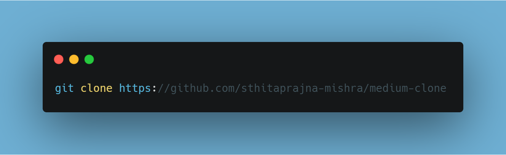

# Cloning Medium: Getting Started with Front-End Web Development

<a href="#">View Demo</a>

## About the project

---

This project is an attempt to create a likeness of the popular website Medium using basic tools of the frontend trade. The clone not only replicates the behaviour of the site but also manages to maintain its original responsiveness.

Following are a few screenshots comparing the real Medium website with this clone - 

**1.1. Medium**

**1.2. Clone**

**2.1. Medium**

**2.2. Clone**

**3.1. Medium**

**3.2. Clone**

As you can see, the clone is able to mimic the real site across various screen dimensions.

#### *Note: This is NOT a dynamic clone. This project replicates only a sample homepage of Medium.*

## Built With

---

+ HTML
+ CSS
+ JQuery
+ JavaScript

## Tools

---

+ [git](https://git-scm.com/downloads)
+ [Visual Studio Code](https://code.visualstudio.com/)
+ [Live Server](https://marketplace.visualstudio.com/items?itemName=ritwickdey.LiveServer)

## Setup and Installation

---

+ In order to set up all the code on your local machine, you can either download a ZIP of all the files directly or you can clone the code to your local machine, provided you installed git.

+ Run the following git command on your command line terminal to clone the files to your machine - 

+ Once the files are on your machine, open the medium-clone folder in Visual Studio Code.

+ With the files open in Visual Studio Code, press the Go Live button at the bottom of the window to launch the files with Live Server.